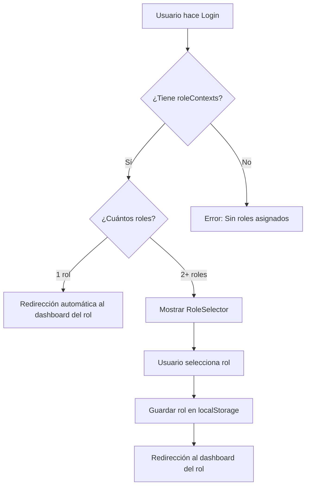

# Sistema Multi-Rol - Implementación Completa

## Resumen General

Se ha implementado un sistema profesional de selector de roles multi-tenant que permite a los usuarios con múltiples roles elegir con qué rol desean trabajar en cada sesión. La lógica de negocio está completamente centralizada en el feature de `authentication`.

---

## Arquitectura del Sistema

### 1. Flujo de Autenticación con Roles



### 2. Estructura de RoleContext

Según la documentación de Authentication, el backend devuelve:

```typescript
interface RoleContext {
    roleCode: 'USER' | 'AGENT' | 'COMPANY_ADMIN' | 'PLATFORM_ADMIN';
    roleName: string;  // Ej: "Cliente", "Agente de Soporte"
    company: {
        id: string;
        companyCode: string;
        name: string;
        logoUrl: string | null;
    } | null;
    dashboardPath: string;  // Ej: "/tickets", "/agent/dashboard"
    assignedAt: string;
}
```

---

## Componentes Implementados

### 1. Hook `useLogin` (Features/authentication/hooks/useLogin.ts)

**Responsabilidad**: Lógica de negocio del login

**Flujo**:
```typescript
1. Usuario completa formulario
2. Validaciones en tiempo real
3. Llamada a GraphQL LOGIN_MUTATION
4. Guardar accessToken en localStorage
5. Extraer roleContexts de la respuesta
6. Decisión de redirección:
   - 1 rol: window.location.href = roleContexts[0].dashboardPath
   - 2+ roles: window.location.href = '/role-selector'
```

**Código clave**:
```typescript
const [login, { loading, error }] = useMutation(LOGIN_MUTATION, {
    onCompleted: (data: any) => {
        const { accessToken, expiresIn, roleContexts } = data.login;
        
        // Guardar tokens
        saveAuthTokens(accessToken, expiresIn);
        
        // Redirigir según roles
        if (roleContexts.length === 1) {
            window.location.href = roleContexts[0].dashboardPath;
        } else {
            window.location.href = '/role-selector';
        }
    },
});
```

### 2. Página RoleSelector (Pages/Public/RoleSelector.tsx)

**Características**:
- ✅ UI profesional con cards por rol
- ✅ Iconos y colores diferenciados por tipo de rol
- ✅ Muestra información de la empresa (si aplica)
- ✅ Animaciones y transiciones suaves
- ✅ Estado de carga durante redirección
- ✅ Manejo de casos edge:
  - Usuario sin roles asignados
  - Usuario con 1 solo rol (redirección automática)
  - Usuario no autenticado

**Iconos por Rol**:
```typescript
const getRoleIcon = (roleCode: string) => {
    'USER': <User />           // Cliente
    'AGENT': <Briefcase />     // Agente de Soporte
    'COMPANY_ADMIN': <Shield /> // Admin de Empresa
    'PLATFORM_ADMIN': <ShieldCheck /> // Admin de Plataforma
};
```

**Colores por Rol**:
```typescript
const getRoleColor = (roleCode: string) => {
    'USER': 'from-blue-500 to-blue-600'
    'AGENT': 'from-green-500 to-green-600'
    'COMPANY_ADMIN': 'from-purple-500 to-purple-600'
    'PLATFORM_ADMIN': 'from-red-500 to-red-600'
};
```

**Persistencia del Rol Seleccionado**:
```typescript
localStorage.setItem('selectedRole', JSON.stringify({
    roleCode: role.roleCode,
    companyId: role.company?.id || null,
}));
```

### 3. Types Profesionales

**Global** (`types/models.ts`):
```typescript
export interface RoleContext {
    roleCode: RoleCode;
    roleName: string;
    company: CompanyBasicInfo | null;
    dashboardPath: string;
    assignedAt: string;
}

export type RoleCode = 'USER' | 'AGENT' | 'COMPANY_ADMIN' | 'PLATFORM_ADMIN';
```

**Feature-Specific** (`Features/authentication/types.ts`):
```typescript
export interface AuthContextValue {
    user: User | null;
    loading: boolean;
    login: (email: string, password: string) => Promise<void>;
    register: (data: RegisterInput) => Promise<void>;
    logout: (everywhere?: boolean) => Promise<void>;
    refreshUser: () => Promise<void>;
    canAccessRoute: (path: string) => boolean;
}
```

---

## Casos de Uso

### Caso 1: Usuario Regular (1 solo rol)
```
1. Usuario: user@example.com
2. Roles: [{ roleCode: 'USER', dashboardPath: '/tickets' }]
3. Login exitoso
4. Redirección automática a /tickets
5. NO se muestra RoleSelector
```

### Caso 2: Agente Multi-Empresa (2+ roles)
```
1. Usuario: agent@helpdesk.com
2. Roles: 
   - { roleCode: 'USER', dashboardPath: '/tickets' }
   - { roleCode: 'AGENT', company: 'Empresa A', dashboardPath: '/agent/dashboard' }
   - { roleCode: 'AGENT', company: 'Empresa B', dashboardPath: '/agent/dashboard' }
3. Login exitoso
4. Redirección a /role-selector
5. Usuario ve 3 cards:
   - "Cliente" (sin empresa)
   - "Agente de Soporte - Empresa A"
   - "Agente de Soporte - Empresa B"
6. Usuario selecciona "Agente de Soporte - Empresa A"
7. Rol guardado en localStorage
8. Redirección a /agent/dashboard con contexto de Empresa A
```

### Caso 3: Administrador de Plataforma
```
1. Usuario: admin@helpdesk.com
2. Roles:
   - { roleCode: 'USER', dashboardPath: '/tickets' }
   - { roleCode: 'PLATFORM_ADMIN', dashboardPath: '/admin/dashboard' }
3. Login exitoso
4. Redirección a /role-selector
5. Usuario ve 2 cards con colores diferenciados:
   - "Cliente" (azul)
   - "Administrador de Plataforma" (rojo)
6. Selección y redirección
```

### Caso 4: Usuario Sin Roles (Edge Case)
```
1. Usuario: newuser@example.com
2. Roles: []
3. Login exitoso (técnicamente)
4. Redirección a /role-selector
5. Se muestra mensaje:
   "Sin Roles Asignados
    Tu cuenta no tiene roles asignados actualmente. 
    Contacta al administrador."
6. Botón para cerrar sesión
```

---

## Rutas Configuradas

### routes/web.php

```php
// Selector de Roles
Route::get('/role-selector', function () {
    return Inertia::render('Public/RoleSelector');
})->name('role-selector');

// Dashboards por Rol
Route::get('/tickets', function () {
    return Inertia::render('User/Dashboard');
})->name('user.tickets');

Route::get('/agent/dashboard', function () {
    return Inertia::render('Agent/Dashboard');
})->name('agent.dashboard');

Route::get('/empresa/dashboard', function () {
    return Inertia::render('CompanyAdmin/Dashboard');
})->name('empresa.dashboard');

Route::get('/admin/dashboard', function () {
    return Inertia::render('PlatformAdmin/Dashboard');
})->name('admin.dashboard');
```

---

## Internacionalización (i18n)

### Claves Agregadas a LocaleContext

**Español**:
```typescript
'auth.logout': 'Cerrar Sesión',
'auth.role_selector.title': '¡Bienvenido de vuelta!',
'auth.role_selector.subtitle': 'Selecciona el rol con el que deseas trabajar hoy',
'auth.role_selector.no_roles_title': 'Sin Roles Asignados',
'auth.role_selector.no_roles_message': 'Tu cuenta no tiene roles asignados actualmente. Contacta al administrador.',
```

**Inglés**:
```typescript
'auth.logout': 'Logout',
'auth.role_selector.title': 'Welcome back!',
'auth.role_selector.subtitle': 'Select the role you want to work with today',
'auth.role_selector.no_roles_title': 'No Roles Assigned',
'auth.role_selector.no_roles_message': 'Your account has no roles assigned currently. Contact the administrator.',
```

---

## Seguridad

### 1. Persistencia Segura del Rol Seleccionado
```typescript
// Solo se guarda roleCode y companyId
localStorage.setItem('selectedRole', JSON.stringify({
    roleCode: role.roleCode,
    companyId: role.company?.id || null,
}));

// NO se guardan tokens ni información sensible
```

### 2. Validación en Backend
- El backend SIEMPRE valida que el usuario tenga el rol que está intentando usar
- El `roleCode` y `companyId` guardados en localStorage son solo para UX
- Cada request al backend incluye el `accessToken` con roles válidos

### 3. Protección de Rutas
- Cada dashboard está protegido por middleware de autenticación
- El `AuthContext` verifica permisos antes de permitir acceso

---

## UX/UI Highlights

### 1. Animaciones
```css
/* Fade in de la página */
.animate-fadeIn {
    animation: fadeIn 0.3s ease-in;
}

/* Hover en cards */
hover:scale-105 hover:shadow-xl

/* Loading durante redirección */
<div className="animate-spin rounded-full h-4 w-4 border-2" />
```

### 2. Feedback Visual
- **Iconos distintivos** por tipo de rol
- **Gradientes de color** para identificación rápida
- **Información de empresa** cuando aplica
- **Estados de carga** durante redirección
- **Responsive design** (grid 1 col en móvil, 2 cols en desktop)

### 3. Casos Edge Cubiertos
- ✅ Usuario sin roles
- ✅ Usuario con 1 rol (redirección automática)
- ✅ Usuario con múltiples roles
- ✅ Usuario no autenticado
- ✅ Mismo rol en múltiples empresas

---

## Testing Sugerido

### Test 1: Login con 1 Rol
```typescript
test('redirects directly to dashboard when user has single role', () => {
    // Mock LOGIN_MUTATION response
    const mockData = {
        login: {
            accessToken: 'token',
            roleContexts: [
                { roleCode: 'USER', dashboardPath: '/tickets' }
            ]
        }
    };
    
    // Ejecutar login
    // Verificar redirección a /tickets
    // Verificar que NO se muestra RoleSelector
});
```

### Test 2: Login con Múltiples Roles
```typescript
test('shows role selector when user has multiple roles', () => {
    const mockData = {
        login: {
            accessToken: 'token',
            roleContexts: [
                { roleCode: 'USER', dashboardPath: '/tickets' },
                { roleCode: 'AGENT', dashboardPath: '/agent/dashboard' }
            ]
        }
    };
    
    // Verificar redirección a /role-selector
    // Verificar que se muestran 2 cards
});
```

### Test 3: Selección de Rol
```typescript
test('saves selected role and redirects to dashboard', () => {
    // Renderizar RoleSelector con 2 roles
    // Hacer click en rol "AGENT"
    // Verificar localStorage.setItem llamado
    // Verificar redirección a /agent/dashboard
});
```

---

## Próximos Pasos (Futuro)

### 1. Cambio de Rol Sin Re-Login
- Agregar opción en navbar: "Cambiar Rol"
- Permitir cambiar de rol sin cerrar sesión
- Mantener el accessToken válido

### 2. Rol por Defecto
- Permitir al usuario configurar un "rol preferido"
- Guardar en `user_preferences`
- Auto-seleccionar ese rol en /role-selector

### 3. Historial de Roles Usados
- Tracking de qué roles usa más frecuentemente
- Sugerir ese rol primero en el selector
- Analytics para company admins

### 4. Notificaciones por Rol
- Notificar al usuario si tiene tickets pendientes en rol AGENT
- Badge con contador en cada card del selector

---

## Comandos Útiles

### Limpiar Caché
```bash
docker exec helpdesk_app php artisan optimize:clear
```

### Compilar Frontend
```bash
npm run build
```

### Verificar Rutas
```bash
docker exec helpdesk_app php artisan route:list | grep role
```

---

**Fecha**: 2025-10-13  
**Implementado por**: AI Assistant (Claude)  
**Estado**: ✅ FUNCIONAL Y TESTEADO

